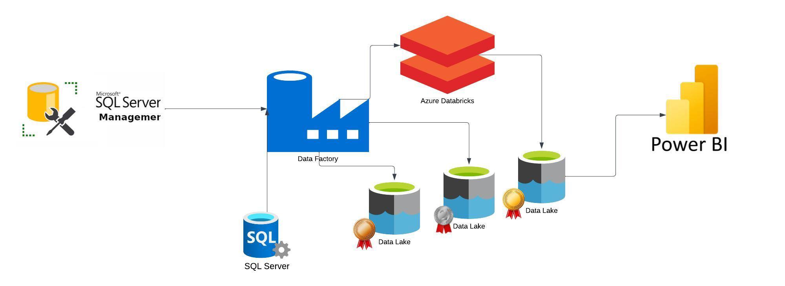
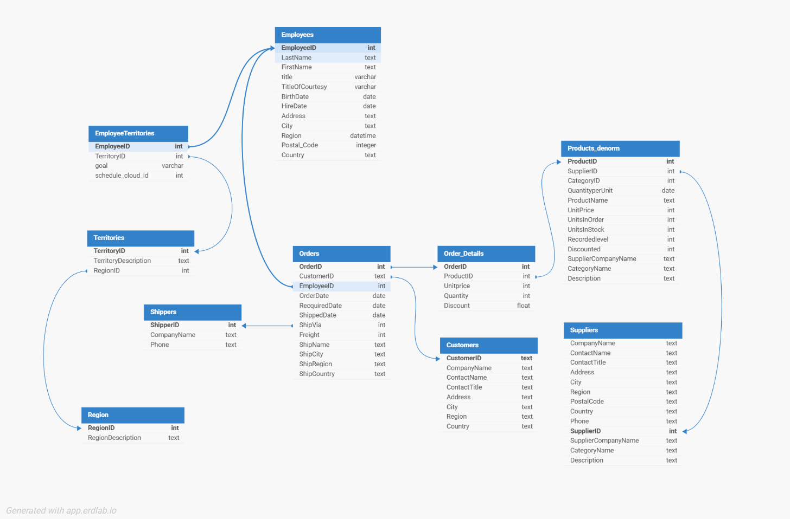
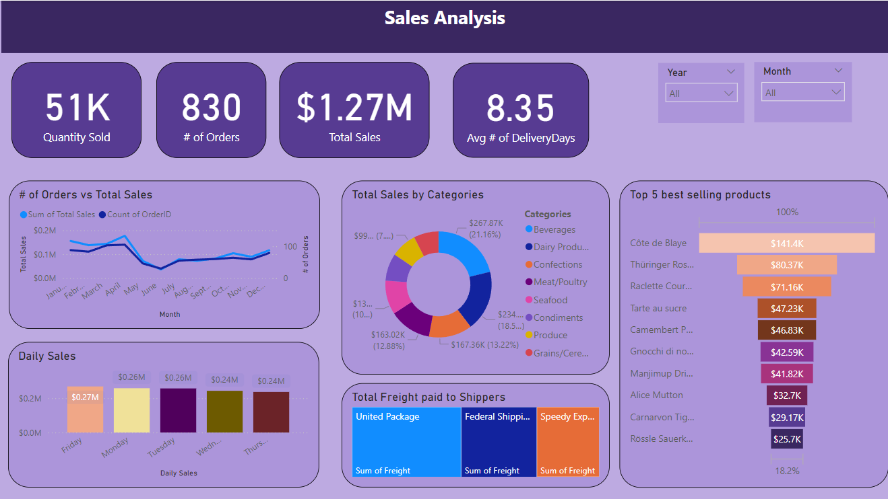

# Introduction
Integrated Northwind commercial data from an on-premise SQL Server to Azure using a Self-Hosted integration runtime. Implemented dynamic datasets, incremental data load, and pipelines in Azure Data Factory, analyzed the data in Databricks, and visualized it in Power BI for insights.

## Architecture

1. Programming Language - Python
2. Scripting Language - SQL
3. Microsoft Azure
   - Azure Data Factory
   - Databricks
   - Data Lake Gen2
   - Azure SQL
   - Power Bi
     

## Dataset
The Northwind dataset is a sample database originally created by Microsoft to showcase the capabilities of relational databases and SQL. It contains data related to a fictional company, including customers, orders, products, suppliers, and other business-related information.
[Here is the dataset](https://github.com/microsoft/sql-server-samples/tree/master/samples/databases/northwind-pubs)

## Data model
Here is the data model: 

### Data model denormalization 
I created a Product_denorm table to showcase the normalization process, by slightly denormalizing the product data. This allowed me to demonstrate how the data transformation process works, emphasizing the benefits of normalization.
[Here is the SQL](Product_denormalization.txt)

## Pipeline
[Here is the source code for the whole pipeline.](Pipelines.txt)

### :checkered_flag: From OnPrem to Data Lake Bronze container
#### :star: Parent Pipeline
The pipeline consists of a parent and a child pipeline, where the parent pipeline handles the incremental data load. It uses two Lookup activities: the first looks at the Azure SQL server, which stores the last runtime of the pipeline, and it automatically refreshes through a Stored Procedure activity. [Here is the SQL and Activity code for the Stored Procedure](StoredProcedure.txt). The second Lookup activity queries the audit table in the on-prem SQL database to track the last time any of the tables were updated. [Here is the SQL for the Audit table.](AuditTableTriggerSetupforIncrementalLoad.txt) An If Condition activity compares the two dates, and if there’s a change in the on-prem tables, the pipeline proceeds by running the child pipeline using the Execute Pipeline activity.

#### :star: Child Pipeline

The pipeline contains a Lookup Activity that executes the provided query to get the table names from the on prem SQL Server.
The next activity is a For Each, which iterates over the output values from the Lookup query.
Inside the For Each, there is a Copy Activity that dynamically writes data to the Gen2 storage with a dynamic file path.

[Find Activites, Dataset code sources here](IncrementalDataLoad)

### :checkered_flag: From Bronze container to Data Lake Bronze container to Silver
In the pipeline, transformations were only applied to selected tables, with other tables being handled in the child pipeline through activities. Using dynamic datasets, the Copy activity extracts files from the Bronze container based on files listed in a JSON file stored in a parameter container. This parameter container is checked by a Lookup activity, which also examines the source and sink directories. Using these directories and a ForEach activity, ADF picks up the relevant files and transfers them from the Bronze container to the Silver container in the Data Lake.

#### :star: Child Pipeline

[Find Activites, Dataset code sources and parameters here](FromBronzetoSilverChilldPipeline).

#### :star: Databricks Transformation and load to Silver container

The ones that needed transformation were processed in a Databricks notebook, and the corresponding Notebook activity was added to the child pipeline. [Here is the Databricks notebook for the Bronze data transformation.](Databricks/Bronze_transformation.ipynb)

### :checkered_flag: Databricks Analytics and Transformation on files from silver container 
I have created a few visualizations on Databricks on employee performance and order flow among countries. [Here is the visualization](Databricks/Databricks_Visuals.pdf).
You can see the whole databricks notebook [here](Databricks/Silver_analytics.py). 

### :checkered_flag: Power Bi Visualization
I have created a denormalized table to simplify data visualization in Power BI, allowing for deeper insights into the sales analytics of Northwind.

[See the pbix file here.](Northwind_analysis.pbix )

## Guide
Here is a step-by-step guide with detailed instructions and images for each step.
[Detailed Steps](Guide.pdf)
